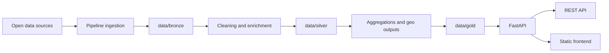

# Urban Data Explorer


Urban Data Explorer est une plateforme data locale pour explorer les dynamiques du logement a Paris. Le projet assemble des sources ouvertes heterogenes, les normalise dans un pipeline Bronze / Silver / Gold, puis les sert via FastAPI dans une interface cartographique interactive.

Le depot est pense comme un monorepo simple a faire evoluer: un pipeline batch, une API lisant directement les artefacts `data/gold`, et un frontend statique sans base de donnees ni couche applicative lourde.

## Sommaire

- [Pourquoi ce projet](#pourquoi-ce-projet)
- [Fonctionnalites](#fonctionnalites)
- [Architecture](#architecture)
- [Structure du depot](#structure-du-depot)
- [Demarrage rapide](#demarrage-rapide)
- [Sources de donnees](#sources-de-donnees)
- [Artefacts produits](#artefacts-produits)
- [API](#api)
- [Livrables](#livrables)
- [Documentation](#documentation)
- [Statut du projet](#statut-du-projet)

## Pourquoi ce projet

Le marche du logement parisien est documente par une multitude de jeux de donnees ouverts, mais ces sources restent dispersees, heterogenes et difficiles a croiser rapidement. Urban Data Explorer propose une couche d'unification operationnelle pour repondre a des questions comme:

- comment evoluent les prix de vente d'un arrondissement a l'autre
- combien de mois de revenu median sont necessaires pour acheter 1 m2
- comment se comparent loyers, revenus et production de logements sociaux
- quelle lecture environnementale associer a un secteur via l'air et le bruit
- que voit-on a une maille plus fine que l'arrondissement: quartier, rue, batiment proxy

## Fonctionnalites

- Pipeline data reproductible avec zones `Bronze`, `Silver` et `Gold`
- Croisement de plusieurs sources publiques: DVF, INSEE Filosofi, Paris Data, Bruitparif, BAN
- Cartographie multi-niveaux: `arrondissement`, `quartier`, `street`, `building`
- Vue de synthese ville + comparaison de deux arrondissements + timeline locale
- Geocodage des ventes via `adresses-ban` avec fallback `BAN Plus`
- API REST simple lisant directement les sorties `data/gold`
- Frontend statique servi par FastAPI, donc zero bundle complexe a maintenir

## Architecture



### Flux principal

1. Les sources ouvertes sont telechargees a partir de `config/sources.yaml`.
2. Le pipeline filtre, nettoie, geocode et enrichit les donnees.
3. Les sorties `Gold` sont materialisees en `CSV`, `GeoJSON` et `JSON`.
4. L'API FastAPI lit ces artefacts et expose les vues necessaires au dashboard.
5. Le frontend JavaScript consomme directement l'API et affiche les cartes, classements et comparaisons.

## Structure du depot

```text
UrbanDataExplorer/
|- api/                  # API FastAPI et routes du dashboard
|- config/               # Catalogue des sources ouvertes
|- data/                 # Zones bronze / silver / gold
|- docs/                 # Documentation fonctionnelle et technique
|- frontend/             # Interface HTML / CSS / JS servie par FastAPI
|- pipeline/             # Ingestion, nettoyage et build des artefacts
`- README.md
```

## Demarrage rapide

### Prerequis

- `Python 3.11+`
- acces reseau pour telecharger les sources ouvertes

### Installation

```powershell
python -m venv .venv
.\.venv\Scripts\Activate.ps1
pip install -r pipeline/requirements.txt -r api/requirements.txt
```

### 1. Lister les sources configurees

```powershell
python pipeline/run_imports.py list
```

### 2. Telecharger les donnees brutes

```powershell
python pipeline/run_imports.py download
```

Sans argument, `download` recupere toutes les sources declarees dans [`config/sources.yaml`](config/sources.yaml).

Le depot GitHub est volontairement lean: les jeux de donnees `Bronze`, `Silver` et `Gold`, les logs locaux et les artefacts bureautiques ne sont pas versionnes. Chaque utilisateur telecharge donc les sources ouvertes et regenere ses sorties localement.

### 3. Construire les sorties Silver / Gold

```powershell
python pipeline/run_imports.py build
```

Option utile pour un build plus rapide si vous ne voulez pas recalculer Bruitparif:

```powershell
python pipeline/run_imports.py build --skip-noise
```

### 4. Lancer l'application

```powershell
python -m uvicorn api.app.main:app --reload
```

Ouvrez ensuite `http://127.0.0.1:8000`.

## Sources de donnees

Le catalogue complet est maintenu dans [`config/sources.yaml`](config/sources.yaml). Les principales sources consommees par le build sont:

| Dataset | Role dans le projet | Maille principale |
| --- | --- | --- |
| `dvf_2023_paris`, `dvf_2024_paris`, `dvf_2025_paris` | Transactions immobilieres, prix au m2, volumes, surfaces, timeline | mutation / adresse |
| `insee_filosofi_2021` | Revenus, niveau de vie, part imposable, taux de pauvrete | IRIS |
| `paris_loyers` | Loyers de reference, majores et minores | quartier |
| `paris_social_housing` | Programmes et volumes de logements sociaux finances | arrondissement / programme |
| `bruitparif_sig_2024` | Scores air / bruit et pression environnementale | couche SIG |
| `reference_arrondissements` | Fond cartographique principal | arrondissement |
| `quartier_paris` | Aggregation fine des ventes et carte quartier | quartier |
| `voie_paris` | Representation lineaire des rues | rue |
| `adresses_ban` | Geocodage des ventes DVF | adresse |
| `iris_paris` | Rattachement spatial fin et sorties IRIS | IRIS |

Service complementaire utilise pendant le build:

- `BAN Plus - lien adresse parcelle`: [service WFS](https://data.geopf.fr/wfs/ows)

Source deja cataloguee mais non consommee par le build actuel:

- `bruitparif_stats_2024`

## Indicateur qualite de vie

Les signaux environnementaux issus de Bruitparif sont regroupes dans un indicateur composite unique expose dans le dashboard: `quality_of_life_score`.

Ce score est calcule sur `10`. Plus il est eleve, meilleure est la qualite de vie environnementale estimee.

### Composantes

- `noise_score`: intensite moyenne du bruit, ramenee en score favorable quand le bruit baisse
- `air_score`: pression moyenne liee a la qualite de l'air, ramenee en score favorable quand l'air s'ameliore
- `high_noise_share_pct`: part de surface exposee aux classes de bruit les plus elevees
- `environmental_pressure_index`: synthese intermediaire air + bruit, conservee comme signal de contexte

### Formule

```text
noise_norm = 1 - ((noise_score - 1) / 2)
air_norm = 1 - ((air_score - 1) / 2)
high_noise_norm = 1 - (high_noise_share_pct / 100)
env_norm = 1 - (environmental_pressure_index / 100)

quality_of_life_score = 10 * (
  0.30 * noise_norm +
  0.30 * air_norm +
  0.25 * high_noise_norm +
  0.15 * env_norm
)
```

### Pourquoi ces coefficients

- `0.30` pour `noise_norm`: le bruit ressenti au quotidien a un impact direct et immediat sur l'habitabilite d'un quartier
- `0.30` pour `air_norm`: la qualite de l'air est un facteur environnemental majeur, comparable en importance au bruit
- `0.25` pour `high_noise_norm`: la part de zones tres bruyantes capture l'exposition aux situations les plus degradantes, mais sur un angle plus localise
- `0.15` pour `env_norm`: l'indice de pression environnementale sert de signal de synthese, avec un poids plus faible pour eviter de compter deux fois des informations deja presentes dans `noise_score` et `air_score`

Les composantes detaillees restent conservees dans les sorties `Gold` pour auditabilite, mais l'interface utilisateur n'expose plus qu'un seul indicateur de lecture: `Qualite de vie`.

## Artefacts produits

Le pipeline produit plusieurs sorties exploitees par l'API et le dashboard:

| Artefact | Description |
| --- | --- |
| `data/gold/arrondissement_summary.csv` | table de synthese principale pour les 20 arrondissements |
| `data/gold/sales_yearly.csv` | serie annuelle des indicateurs de ventes par arrondissement |
| `data/gold/sales_quartier_yearly.csv` | vue agregree par quartier administratif |
| `data/gold/sales_iris_yearly.csv` | vue agregree par IRIS |
| `data/gold/sales_street_yearly.csv` | vue agregree par rue |
| `data/gold/sales_building_yearly.csv` | vue agregree par batiment proxy / adresse |
| `data/gold/sales_geocoded.csv` | transactions geocodees et enrichies |
| `data/gold/arrondissements.geojson` | couche cartographique des arrondissements |
| `data/gold/quartiers.geojson` | couche cartographique des quartiers |
| `data/gold/streets.geojson` | couche cartographique des rues |
| `data/gold/iris.geojson` | couche cartographique des IRIS |
| `data/gold/dashboard.json` | metadonnees du dashboard, catalogue de metriques et annees disponibles |

Le niveau `building` est un proxy d'adresse / batiment construit a partir de `cle_interop` BAN quand elle existe, avec repli sur la parcelle cadastrale puis sur une cle d'adresse normalisee.

## API

L'API lit directement les artefacts `data/gold` et sert a la fois les donnees et le frontend statique.

### Endpoints principaux

| Endpoint | Usage |
| --- | --- |
| `GET /` | page d'accueil du dashboard |
| `GET /health` | verification simple du service |
| `GET /sources` | catalogue des sources avec libelles, resumes et URLs |
| `GET /api/meta` | metriques disponibles, annees et niveaux cartographiques |
| `GET /api/overview?sales_year=2025` | synthese ville + donnees des arrondissements |
| `GET /api/timeline?arrondissement=11` | chronologie ventes / loyers / logement social |
| `GET /api/compare?left=11&right=18&sales_year=2025` | comparaison de deux arrondissements |
| `GET /api/map?metric=median_price_m2&level=arrondissement&year=2025` | couche cartographique pour une metrique |
| `GET /api/reference/quartier` | geometries de reference pour certains niveaux fins |

### Metriques exposees

Exemples de metriques disponibles dans le dashboard:

- `median_price_m2`
- `transactions`
- `median_surface_m2`
- `median_income_eur`
- `reference_rent_majorated_eur_m2`
- `social_units_financed`
- `social_units_financed_5y`
- `months_income_for_1sqm`
- `estimated_50m2_rent_effort_pct`
- `quality_of_life_score`

Pour le detail des formules et du sens de chaque indicateur, voir [`docs/data-catalog.md`](docs/data-catalog.md).

## Livrables

Le repo couvre les 3 livrables principaux suivants:

1. Code source complet: `pipeline + API + frontend`
   Preuves: `pipeline/`, `api/`, `frontend/`
2. Documentation d'architecture et schemas data
   Preuve: [`docs/architecture.md`](docs/architecture.md)
3. Mini data catalog avec justification des sources et des choix
   Preuve: [`docs/data-catalog.md`](docs/data-catalog.md)

## Documentation

- [`docs/architecture.md`](docs/architecture.md): vue d'ensemble technique et logique Bronze / Silver / Gold
- [`docs/data-catalog.md`](docs/data-catalog.md): catalogue des sources et lecture des indicateurs
- [`pipeline/README.md`](pipeline/README.md): commandes du pipeline
- [`api/README.md`](api/README.md): lancement du backend
- [`frontend/README.md`](frontend/README.md): principes du frontend

## Statut du projet

Le projet est aujourd'hui structure comme un prototype data solide, local-first et facile a etendre:

- pas de base de donnees a maintenir pour demarrer
- artefacts `Gold` lisibles et versionnables
- architecture simple pour ajouter de nouvelles sources ou de nouvelles mailles cartographiques

Les prochaines evolutions naturelles seraient:

- industrialiser les tests et la validation des builds
- packager le pipeline pour des executions planifiees
- enrichir encore les metriques de qualite de vie et de couverture spatiale
