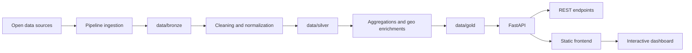
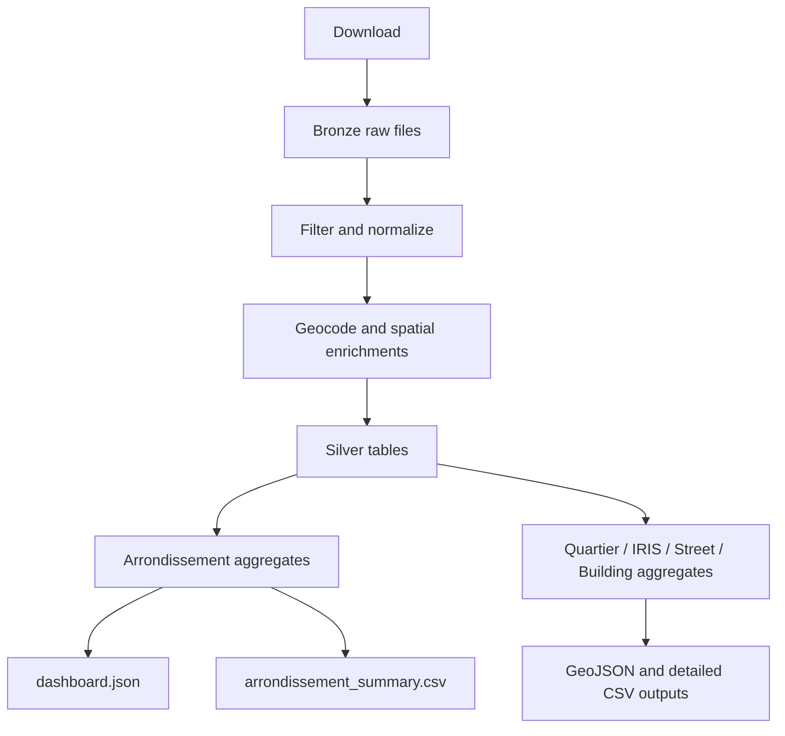
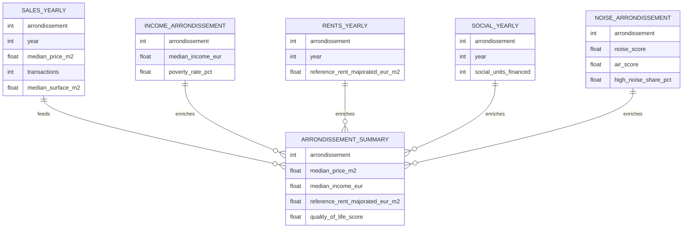

# Architecture

## Objectif

Urban Data Explorer est une application data locale-first qui transforme plusieurs sources ouvertes heterogenes en un dashboard web cohérent sur le logement parisien.

L'architecture poursuit quatre objectifs:

- isoler clairement l'ingestion, la transformation et l'exposition
- garder des sorties auditables et reutilisables sans base de donnees
- faciliter l'evolution vers de nouvelles mailles geographiques et nouvelles metriques
- permettre une demo fluide avec un frontend simple, rapide a lancer et a expliquer

## Vue d'ensemble



## Composants

### 1. Pipeline

Responsabilite:

- telecharger les sources configurees dans `config/sources.toml`
- filtrer et nettoyer les donnees brutes
- normaliser les variables de prix, surfaces, dates et identifiants geographiques
- enrichir les transactions par geocodage, quartier, IRIS, rue et batiment proxy
- produire les tables et couches `Silver` et `Gold`

Principaux fichiers:

- `pipeline/run_imports.py`
- `pipeline/src/urban_data_explorer/cli.py`
- `pipeline/src/urban_data_explorer/build.py`
- `pipeline/src/urban_data_explorer/ingestion/downloader.py`

### 2. Stockage par zones

Responsabilite:

- `Bronze`: conserver les fichiers sources telecharges
- `Silver`: stocker les tables nettoyees et enrichies
- `Gold`: stocker les artefacts optimises pour l'API et le dashboard

Le choix de fichiers plats `CSV`, `GeoJSON` et `JSON` rend les sorties:

- versionnables si besoin
- faciles a inspecter
- simples a servir sans infrastructure supplementaire

### 3. API FastAPI

Responsabilite:

- lire les artefacts `data/gold`
- exposer les endpoints du dashboard
- servir aussi les fichiers statiques du frontend

Principaux endpoints:

- `GET /health`
- `GET /sources`
- `GET /api/meta`
- `GET /api/overview`
- `GET /api/timeline`
- `GET /api/compare`
- `GET /api/map`
- `GET /api/reference/{level}`

### 4. Frontend

Responsabilite:

- recuperer les donnees via l'API
- afficher la carte principale, les KPIs, la comparaison et la timeline
- permettre une lecture multi-niveaux: `arrondissement`, `quartier`, `street`, `building`

Stack:

- `HTML`
- `CSS`
- `JavaScript`
- `MapLibre GL`

## Organisation du depot

```text
UrbanDataExplorer/
|- api/
|  `- app/
|- config/
|  `- sources.toml
|- data/
|  |- bronze/
|  |- silver/
|  `- gold/
|- docs/
|- frontend/
|- pipeline/
|  `- src/urban_data_explorer/
`- README.md
```

## Cycle de vie de la data



## Modele de donnees simplifie



## Niveaux geographiques servis

| Niveau | Usage | Sorties principales |
| --- | --- | --- |
| `arrondissement` | KPIs, comparaison, carte principale | `arrondissement_summary.csv`, `arrondissements.geojson` |
| `quartier` | lecture plus fine du marche | `sales_quartier_yearly.csv`, `quartiers.geojson` |
| `street` | lecture lineaire des voies | `sales_street_yearly.csv`, `streets.geojson` |
| `building` | proxy d'adresse / batiment | `sales_building_yearly.csv`, `sales_geocoded.csv` |
| `IRIS` | enrichissements statistiques fins | `sales_iris_yearly.csv`, `iris.geojson` |

## Choix d'architecture

### Pourquoi pas de base de donnees

Pour ce projet, les artefacts `Gold` suffisent:

- volume raisonnable pour une demo
- faible complexite d'exploitation
- excellent niveau de lisibilite pour la soutenance

### Pourquoi FastAPI sert aussi le frontend

- une seule commande de lancement
- moins de friction en demo
- pas de reverse proxy supplementaire a expliquer

### Pourquoi plusieurs mailles spatiales

- l'arrondissement est lisible pour un public large
- le quartier et l'IRIS donnent plus de finesse analytique
- la rue et le batiment proxy rendent la demo plus visuelle et plus impressionnante

## Limites actuelles

- pas de deploiement public automatise dans le repo a ce stade
- pas de tests automatises complets sur la qualite des builds
- les datasets publics restent telecharges localement plutot que versionnes
- les calculs de qualite de vie reposent sur des ponderations explicites mais discutables

## Evolutions naturelles

- ajouter une CI pour verifier le pipeline et l'API
- industrialiser la regeneration des artefacts `Gold`
- brancher un stockage objet ou une base analytique si les volumes augmentent
- ajouter une strategie de deploiement public du dashboard avec jeux de test preconstruits
