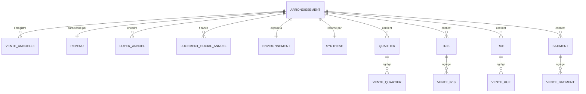

# Modèle de données relationnel (MCD / MLD / MPD)

Ce document décrit la **modélisation relationnelle** des tables `Gold` stockées dans MySQL :
du modèle conceptuel (MCD) au modèle physique (MPD), avec les clés et contraintes réellement
appliquées par le pipeline.

> Les couches cartographiques (GeoJSON) et métadonnées sont stockées à part dans **MongoDB**
> (voir [`architecture.md`](architecture.md)) — ce document ne couvre que la partie **relationnelle**.

---

## 1. MCD — Modèle Conceptuel de Données

Entité centrale : l'**Arrondissement** (les 20 arrondissements parisiens). Toutes les mesures
gravitent autour de lui, soit directement, soit via une maille plus fine (quartier, IRIS, rue,
bâtiment) qui « appartient à » un arrondissement.



**Règles de gestion**
- Un arrondissement a **plusieurs** ventes annuelles (une ligne par année).
- Un arrondissement a **un** profil de revenu et **un** profil environnemental consolidés.
- Quartier, IRIS, rue et bâtiment sont des **mailles fines** rattachées à un arrondissement.

---

## 2. MLD — Modèle Logique de Données

Chaque entité devient une table ; la clé logique est soulignée par la **clé primaire**.
`arrondissement` (entier 1–20) est la clé de jointure transverse.

| Table (nom logique) | Table physique MySQL | Clé primaire | Clés / index secondaires |
|---|---|---|---|
| `gold_summary` | `gold_arrondissement_summary` | **(arrondissement)** | — |
| `gold_sales` | `gold_sales_yearly` | **(arrondissement, year)** | — |
| `gold_income` | `gold_income_arrondissement` | **(arrondissement)** | — |
| `gold_rents` | `gold_rents_yearly` | **(arrondissement, year)** | — |
| `gold_social` | `gold_social_yearly` | **(arrondissement, year)** | — |
| `gold_noise` | `gold_noise_arrondissement` | **(arrondissement)** | — |
| `gold_sales_quartier` | `gold_sales_quartier_yearly` | (quartier_id, year)* | idx (arrondissement, year) |
| `gold_sales_iris` | `gold_sales_iris_yearly` | (iris_code, year)* | idx (arrondissement, year) |
| `gold_sales_street` | `gold_sales_street_yearly` | (street_key, year)* | idx (arrondissement, year) |
| `gold_sales_building` | `gold_sales_building_yearly` | (building_id, year)* | idx (arrondissement, year) |

\* Pour les mailles fines, la clé logique repose sur un identifiant **textuel** (quartier_id,
iris_code, street_key, building_id). On matérialise un **index** sur `(arrondissement, year)`
plutôt qu'une PK sur une colonne TEXT (qui imposerait une longueur de préfixe en MySQL). La clé
métier reste documentée ici comme contrainte d'unicité logique.

---

## 3. MPD — Modèle Physique et contraintes appliquées

Le pipeline écrit les tables via `pandas.to_sql(if_exists="replace")`, puis **applique les
contraintes** de façon idempotente à chaque build (fonction
[`apply_table_keys`](../common/database.py) appelée par
[`build.py`](../pipeline/src/urban_data_explorer/build.py), mapping `GOLD_TABLE_KEYS`).

Exemple de DDL généré et exécuté après le build :

```sql
ALTER TABLE `gold_arrondissement_summary` ADD PRIMARY KEY (`arrondissement`);
ALTER TABLE `gold_sales_yearly`           ADD PRIMARY KEY (`arrondissement`, `year`);
ALTER TABLE `gold_rents_yearly`           ADD PRIMARY KEY (`arrondissement`, `year`);
ALTER TABLE `gold_social_yearly`          ADD PRIMARY KEY (`arrondissement`, `year`);
ALTER TABLE `gold_income_arrondissement`  ADD PRIMARY KEY (`arrondissement`);
ALTER TABLE `gold_noise_arrondissement`   ADD PRIMARY KEY (`arrondissement`);
ALTER TABLE `gold_sales_quartier_yearly`  ADD INDEX `idx_arrondissement_year` (`arrondissement`, `year`);
ALTER TABLE `gold_sales_iris_yearly`      ADD INDEX `idx_arrondissement_year` (`arrondissement`, `year`);
ALTER TABLE `gold_sales_street_yearly`    ADD INDEX `idx_arrondissement_year` (`arrondissement`, `year`);
ALTER TABLE `gold_sales_building_yearly`  ADD INDEX `idx_arrondissement_year` (`arrondissement`, `year`);
```

**Vérification** (après `build`) :

```sql
SHOW KEYS FROM gold_sales_yearly;
-- Key_name=PRIMARY  Seq_in_index=1 Column_name=arrondissement
-- Key_name=PRIMARY  Seq_in_index=2 Column_name=year
```

### Pourquoi appliquer les clés *après* le chargement
`pandas.to_sql` ne sait pas déclarer de PK/FK. Plutôt que d'abandonner la modélisation, on
sépare **chargement** (rapide, en masse) et **contraintes** (DDL idempotent post-charge). C'est un
pattern ELT classique : *load then constrain*. La fonction tolère les ré-exécutions (un
`ADD PRIMARY KEY` déjà présent est simplement ignoré et rapporté comme `skip`).

### Intégrité référentielle
`arrondissement` joue le rôle de **clé étrangère logique** entre toutes les tables (et vers
`gold_arrondissement_summary`). Les FK physiques ne sont pas déclarées car les tables sont
**reconstruites** entièrement à chaque build (drop/replace) — une FK bloquerait le `replace`.
L'intégrité est garantie en amont par la jointure spatiale du pipeline (chaque ligne fine est
rattachée à un arrondissement valide 1–20) et contrôlée par la commande `validate`.

---

## 4. Lecture des tables principales

| Table | Grain | Champs analytiques clés |
|---|---|---|
| `gold_arrondissement_summary` | 1 ligne / arrondissement | `median_price_m2`, `median_income_eur`, `quality_of_life_score`, `months_income_for_1sqm`, `estimated_50m2_rent_effort_pct` |
| `gold_sales_yearly` | arrondissement × année | `transactions`, `median_price_m2`, `median_surface_m2`, `apartment_share_pct` |
| `gold_income_arrondissement` | 1 ligne / arrondissement | `median_income_eur`, `poverty_rate_pct` |
| `gold_rents_yearly` | arrondissement × année | `reference_rent_majorated_eur_m2` |
| `gold_social_yearly` | arrondissement × année | `social_units_financed`, `program_count` |
| `gold_noise_arrondissement` | 1 ligne / arrondissement | `noise_score`, `air_score`, `high_noise_share_pct` |

Pour le détail des indicateurs composites, voir [`data-catalog.md`](data-catalog.md).
